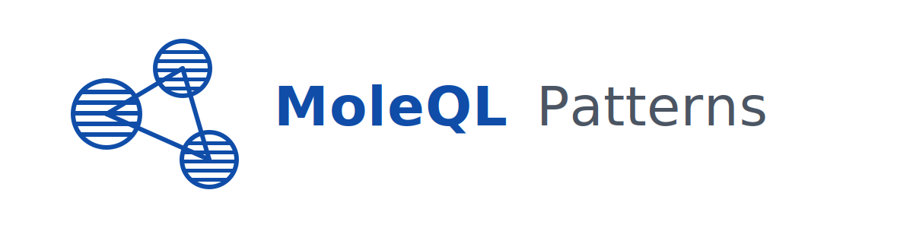

# MoleQL Patterns



[](https://github.com/OneTesseractInMultiverse/moleql-patterns/actions/workflows/ci.yml)
[](https://github.com/OneTesseractInMultiverse/moleql-patterns/actions/workflows/codeql.yml)
[](https://codecov.io/gh/OneTesseractInMultiverse/moleql-patterns)

Reusable base classes and design patterns for clean, decoupled application architecture.

**moleql-patterns** is a lightweight Python library built on **Pydantic** and inspired by **FastAPI**.
It provides small, composable abstractions that standardize common application behaviors
without framework lock-in.

The library focuses on explicit contracts and dependency injection. It keeps transport and storage
separate from business logic. This project serves infrastructure work. It stays explicit, predictable,
and easy to reason about.

---

## Requirements

- Python **3.12+**

---

## Installation

```bash
pip install moleql-patterns
```

### Poetry

```bash
poetry add moleql-patterns
```

### uv

```bash
uv add moleql-patterns
```

---

## Usage

### Command Pattern Contracts

The `commands` package defines a Command pattern API. Each class holds inputs,
dependencies, and behavior. It standardizes operations and background tasks.

Command pattern purpose. It turns deferred work into explicit, testable objects.
It gives a stable interface for execution. Concrete classes take dependencies in
the constructor. This supports dependency injection in application code. It keeps
side effects in one place. Unit tests stay small. It separates orchestration from
business logic.

You can import from the top-level package:

```python
from moleql_patterns import APIOperation, AsyncAPIOperation, Task, AsyncTask, TaskData
```

Or import directly from `commands`:

```python
from moleql_patterns.commands import APIOperation, AsyncTask, TaskData
```

**Synchronous API operation**

```python
from pydantic import BaseModel
from moleql_patterns import APIOperation, AccessDeniedError


class CreateUserResult(BaseModel):
    user_id: str


class CreateUser(APIOperation[CreateUserResult]):
    def __init__(self, repo, current_user) -> None:
        self._repo = repo
        self._current_user = current_user

    def verify_access(self) -> None:
        self._current_user.require_admin()

    def _execute(self) -> CreateUserResult:
        user = self._repo.create_user()
        return CreateUserResult(user_id=user.id)


result = CreateUser(repo, current_user).execute()
```

**Async API operation**

```python
from pydantic import BaseModel
from moleql_patterns import AsyncAPIOperation


class FetchUserResult(BaseModel):
    user_id: str


class FetchUser(AsyncAPIOperation[FetchUserResult]):
    def __init__(self, repo, current_user) -> None:
        self._repo = repo
        self._current_user = current_user

    def verify_access(self) -> None:
        return None

    async def _execute_async(self) -> FetchUserResult:
        user = await self._repo.fetch_user()
        return FetchUserResult(user_id=user.id)


result = await FetchUser(repo, current_user).execute_async()
```

**Background task with validated payload**

```python
from moleql_patterns import Task, TaskData


class SendEmailData(TaskData):
    recipient: str
    subject: str


class SendEmailTask(Task[SendEmailData]):
    task_data_cls = SendEmailData

    def __init__(self, payload, mailer) -> None:
        self._mailer = mailer
        super().__init__(payload)

    def exec(self) -> str:
        self._mailer.send(self.task_data.recipient, self.task_data.subject)
        return "sent"
```

---

### Structural Entities

The `structural` package provides a base `Entity` class for repository work. It
keeps entity definitions separate from persistence choices. Storage details live
in a concrete `EntityRepository`. Each entity must declare a concrete ID type to
keep repository interfaces explicit and type-safe.

```python
from datetime import datetime, UTC
from moleql_patterns import Entity


class User(Entity[int]):
    name: str


now = datetime.now(UTC)
user = User(id=1, name="Ada", created_at=now, updated_at=now)
```

---

### Structural Repositories

The `EntityRepository` contract defines a technology neutral interface for storage.
Concrete repositories take dependencies in the constructor through injection. They
implement each method in the contract. Concrete code holds persistence details.
This keeps business logic separate from the persistence layer. Liskov's substitution
principle allows one repository to replace another.

```python
from moleql_patterns import Entity, EntityRepository


class User(Entity[int]):
    name: str


class UserRepository(EntityRepository[int, User, dict[str, str] | None]):
    def __init__(self, db) -> None:
        self._db = db

    def add(self, entity: User) -> None:
        ...

    def get(self, entity_id: int) -> User | None:
        ...

    def list(self, query: dict[str, str] | None = None) -> list[User]:
        ...

    def update(self, entity: User) -> None:
        ...

    def remove(self, entity: User) -> None:
        ...
```

---

## Design Goals

- Keep contracts small and explicit
- Keep domain logic separate from transport and storage
- Use Pydantic models for validation and boundaries
- Use dependency injection for services and repositories
- Support sync and async flows

---

## Status

This project is in early development. APIs change ahead of a stable `1.0` release.

---

## Documentation

- 📘 **Contributor Guide**: see [CONTRIBUTING.md](CONTRIBUTING.md)
- 🛠 **Development Guide**: see [DEVELOPMENT.md](DEVELOPMENT.md)
- 🔐 **Security Policy**: see [SECURITY.md](SECURITY.md)
- 🚀 **Release Process**: see [RELEASING.md](RELEASING.md)

---

## Make Commands

This repository includes a Makefile with common developer workflows:

```bash
make help
make test
make format
make build
make hooks
make upgrade
make bump-patch
make bump-minor
make bump-major
```

Use `make help` to see the full list of commands and descriptions.

---

## Maintainers Only

The following applies to project maintainers.

### Responsibilities

- Review and merge pull requests
- Enforce architectural consistency
- Maintain API stability guarantees
- Manage releases and PyPI publishing
- Respond to security disclosures

### Expectations

- Changes affecting public APIs must be discussed ahead of merging
- Breaking changes require clear documentation and versioning
- Releases must follow the documented release process
